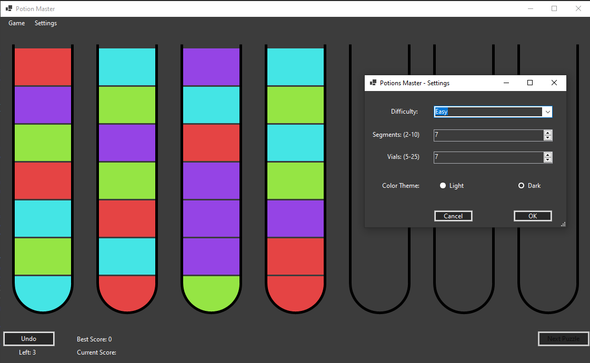

# Potion Master

**Potion Master** is a challenging puzzle game developed using Windows Forms (WinForms), where players must strategically rearrange colored potion segments across vials to solve each puzzle. With adjustable difficulty, customizable vial and segment counts, and a clean dark/light theme interface, Potion Master offers engaging logic-based gameplay wrapped in a visually appealing design.

  

## 📝 Game Description

In **Potion Master**, your goal is to organize potions by color within multiple vials. Each vial can hold several segments of potion, and you must use logic and planning to move potion segments between vials to complete each level's unique challenge.

---

## 🚀 Features

- **Engaging Puzzle Gameplay**: Sort potion segments by color across multiple vials.
- **Adjustable Difficulty**: Select difficulty levels to increase the complexity of puzzles.
- **Customizable Vials and Segments**: Configure the number of potion segments per vial and the total vial count to tailor your challenge.
- **Undo Functionality**: Undo moves to rethink your strategy without penalty.
- **Dark and Light Themes**: Switch between dark and light mode for a comfortable playing experience.
- **Score Tracking**: Keep track of your best score and the number of moves left.
- **Next Puzzle Button**: Easily advance to new challenges when ready.

---

## 🎮 Installation

1. Clone the repository.
2. Build the project.
3. Enjoy!

---

## 🕹️ User Manual

### Getting Started

1. Launch the game.
2. Navigate to **Settings** to customize your gameplay experience:
   - Select difficulty (Easy, Medium, Hard).
   - Set the number of segments per vial (between 2 and 10).
   - Set the number of vials (between 5 and 25).
   - Choose between Light or Dark theme.
3. Press **OK** to apply settings or **Cancel** to revert.

### Gameplay Instructions

- Click on a vial segment to pick up the potion segment.
- Drag it and drop on another vial to pour the potion segment into it.
- The objective is to sort the potions so each vial contains segments of a single color.
- Use the **Undo** button to reverse your last move.
- Once you've completed the puzzle, use the **Next Puzzle** button to try a new challenge.
- Score from one session accumulates untli you click **End Game**. Afterwards it will be saved if that is your biggest score. 
- You can always abourt present session and start a new one by clicking **New Game**. 

## Controls

- **Mouse**: Click on vials to pick up and pour potion segments.
- **Undo Button**: Reverse your previous move.
- **Next Puzzle Button**: Proceed to the next puzzle (enabled after solving the current one).

---

Enjoy becoming the ultimate **Potion Master** by mastering the art of potion sorting and logic puzzles!

